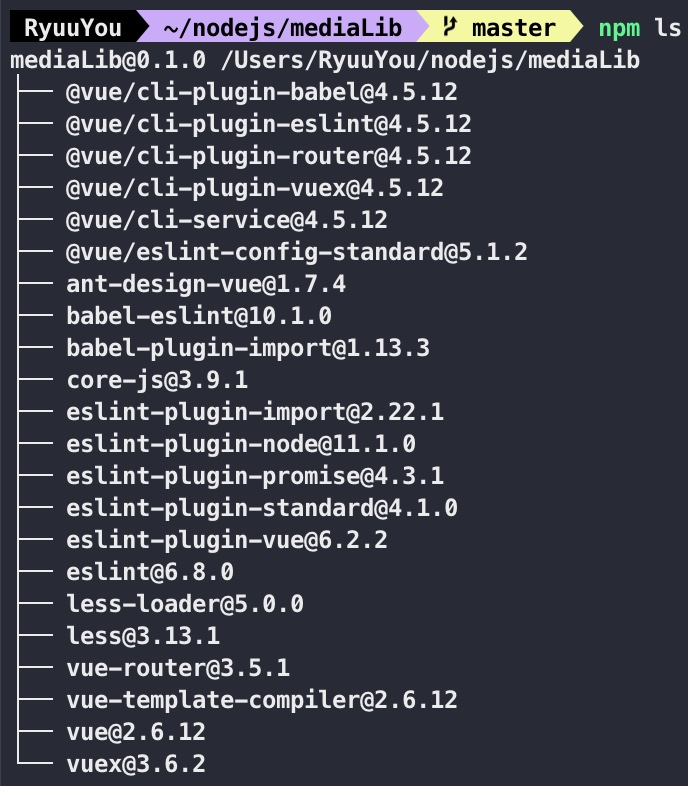
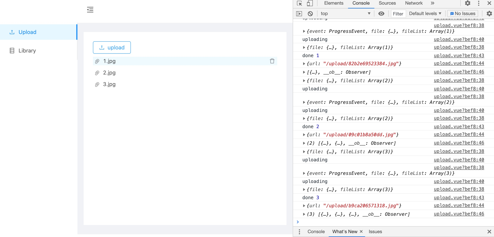
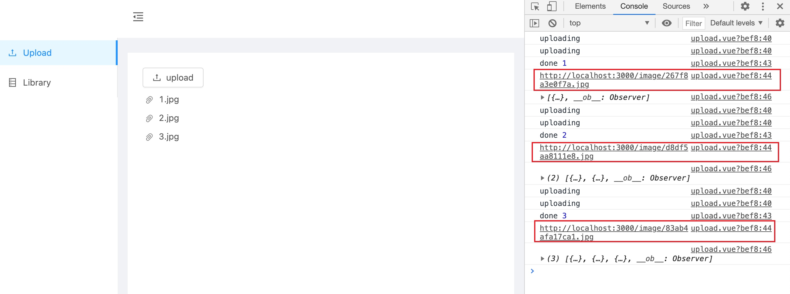
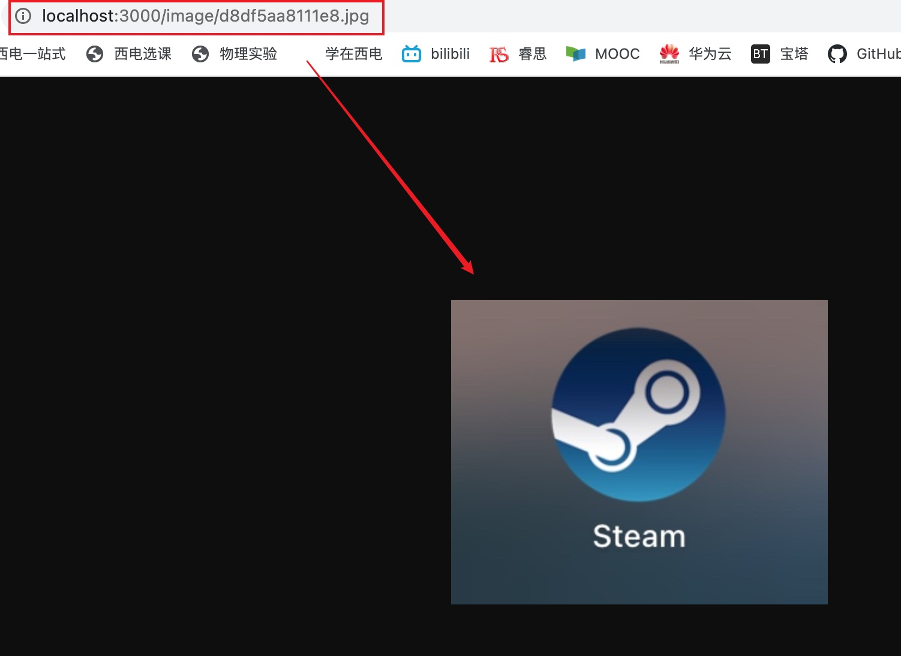

# 项目管理大作业-后端-图床
## 目录结构：
mediaLib
|—— public 	//前端demo静态资源
|—— src		//前端demo源码
|—— server	//后端源码
|	|—— index.js //后端入口
## 所需模块
- 前端demo
  - vue/cli
  

- 后端
  - koa
  - koa-views
  - koa-static
  - koa2-cors
  - busboy
  - ejs

## API
### 上传图片
- 请求地址：
  http://localhost:3000/api/picture/upload 
  （xxx:xx/api/picture/upload）
- 响应
  {
  ​	success: boolean,
  ​	message: string,
  ​	data: {
  ​		pictureUrl: string
  ​		//其他暂无...
  ​	}
  }
## 演示

