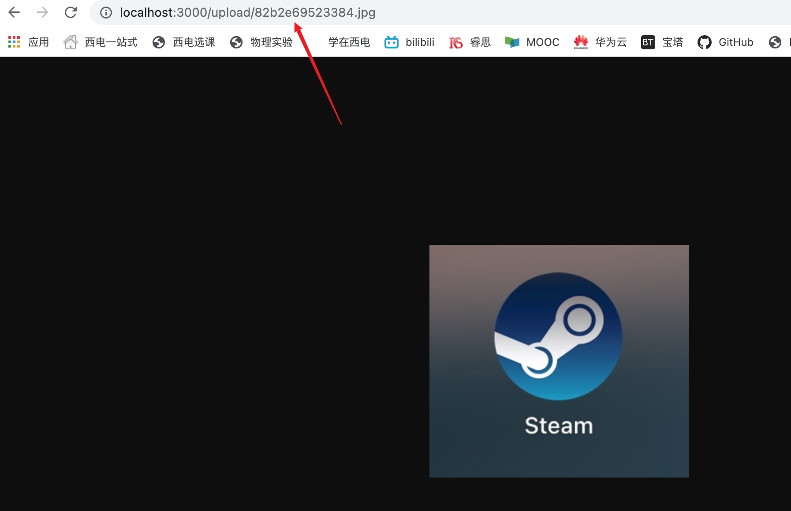

# 项目管理大作业-后端-图床
## 目录结构：
mediaLib

|—— public 	//前端demo静态资源

|—— src		//前端demo源码

|—— server	//后端源码

|	|—— index.js //后端入口

## 所需模块
- 前端demo
  - vue/cli
  

- 后端
  - koa
  - koa-views
  - koa-static
  - koa2-cors
  - busboy
  - ejs

## API
### 上传图片
- 请求：

  http://localhost:3000/api/picture/upload 

  （xxx:xx/api/picture/upload）

- 响应

  {

  ​	success: boolean,

  ​	message: string,

  ​	data: {

  ​		pictureUrl: string

  ​		//其他暂无...

  ​	}

  }
### 删除图片

- 请求：

  http://localhost:3000/api/picture/deleteOne

  （xxx:xx//api/picture/deleteOne）

- 响应

  {

  ​	success: boolean,

  ​	message: string

  }

### 获取所有图片

- 请求：

  http://localhost:3000/api/picture/getAll

  （xxx:xx//api/picture/getAll）

- 响应

  {

  ​	success: boolean,

  ​	message: string,

  ​	collection: []

  }

## 演示

