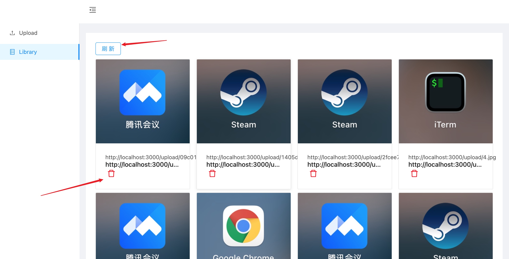

# 项目管理大作业-后端-图床
## 目录结构：
mediaLib

|—— public 	//前端demo静态资源

|—— src		//前端demo源码

|—— server	//后端源码

|	|—— index.js //后端入口

## 所需模块
- 前端demo

  目录：/	

  npm install

  

- 后端

  目录：/

  npm install

## API
### 上传图片
- 请求：

  /api/picture/upload 

- 响应

  - 成功

    {

    ​	status: 200,

    ​	message: 'OK',

    ​	body: {

    ​		url: /upload/example.jpg

    ​	}

    }

  - 失败

    {

    ​	status: 500,

    ​	message: 'upload error'

    }
### 删除图片

- 请求：

  /api/picture/deleteOne

- 响应

  - 成功

    {

    ​	success: 200,

    ​	message: 'OK'
  
    }
  
  - 失败
  
    {
  
    ​	status: 500,
  
    ​	message: 'delete error'
  
    }

### 获取所有图片

- 请求：

  /api/picture/getAll

- 响应

  - 成功

    {

    ​	success: 200,

    ​	message: 'OK',

    ​	body: {

    ​		collection: []
    
    ​	}
    
    }

  - 失败

    {

    ​	status: 500,

    ​	message: 'getAll error'

    }

## 演示

